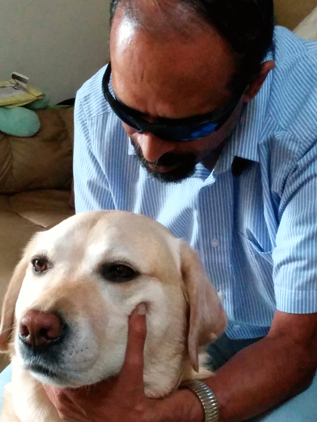

# TVRaman: GitHub Home #
<table><tr><td colspan=2>
</td></tr>
<tr>
<td><a href="vita/resume.pdf">Resume (PDF)</a></td>
<td><a href="vita/resume.html">Resume (HTML)</a></td>
<td><a href="tv.raman.tv.asc">GPG Key For tv.raman.tv</a></td>
</tr>
</table>

 

## Emacspeak ##
* [GitHub: Releases](https://github.com/tvraman/emacspeak/releases/)
*  [GitHub:Source Code](https://github.com/tvraman/emacspeak)
* [GitHub:Project Pages](./emacspeak) User manual, Blog articles, Web pages.
*  [SourceForge](http://emacspeak.sf.net)

## Audio System For Technical Readings (AsTeR) ##

Audio System For Technical Readings (AsTeR) was implemented for my PhD
at Cornell and awarded The [ACM Doctoral Dissertation Award](http://www.acm.org/awards/dd_citation/1994B.html) in 1994.

* [GitHub Source Code](https://github.com/tvraman/aster-math)
* [Interactive Demo](http://emacspeak.sourceforge.net/raman/aster/aster-toplevel.html)
